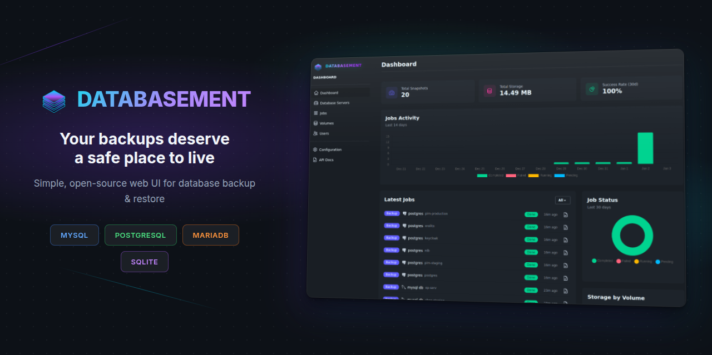

<p align="center">
  <a href="https://github.com/David-Crty/databasement">
    
  </a>
</p>

<p align="center">
  <a href="https://github.com/David-Crty/databasement/blob/main/LICENSE">
    
  </a>
  <a href="https://app.codecov.io/gh/David-Crty/databasement">
    
  </a>
  <a href="https://github.com/David-Crty/databasement/actions">
    
  </a>
  <a href="https://artifacthub.io/packages/helm/databasement/databasement">
    
  </a>
</p>

<p align="center">
  A modern, self-hosted database backup management application for MySQL, PostgreSQL, and MariaDB.
</p>

<p align="center">
  <a href="https://databasement-demo.crty.dev/"><strong>Live Demo</strong></a> ·
  <a href="https://david-crty.github.io/databasement/">Documentation</a> ·
  <a href="https://github.com/David-Crty/databasement/issues">Report Bug or Request Feature</a> ·
</p>

---

## Features

- **Multi-database support** — Manage MySQL, PostgreSQL, and MariaDB servers from a single interface
- **Automated backups** — Schedule recurring backups on daily or weekly intervals. Flexible retention policies: simple time-based (days) or GFS (grandfather-father-son)
- **Multiple compression options** — gzip, zstd (20-40% better compression), or encrypted (AES-256 for sensitive data)
- **Cross-server restore** — Restore snapshots from production to staging, or between any compatible servers
- **Flexible storage** — Store backups locally, on S3-compatible storage (AWS S3, MinIO, etc.), or remote servers via SFTP/FTP
- **Real-time monitoring** — Track backup and restore progress with detailed job logs
- **Team ready** — Multi-user support with role-based access and optional two-factor authentication
- **Simple deployment** — Single Docker container with built-in web server, queue worker, and scheduler

> **Try it out!** Explore the [live demo](https://databasement-demo.crty.dev/) to see Databasement in action before installing.

## Self-Hosting

Databasement is designed to be self-hosted. We provide several deployment options:

| Method | Description | Guide |
|--------|-------------|-------|
| **Docker** | Single container deployment | [View Guide](https://david-crty.github.io/databasement/self-hosting/docker) |
| **Docker Compose** | Multi-container setup with external database | [View Guide](https://david-crty.github.io/databasement/self-hosting/docker-compose) |
| **Kubernetes + Helm** | For Kubernetes clusters | [View Guide](https://david-crty.github.io/databasement/self-hosting/kubernetes-helm) |
| **Native Ubuntu** | Traditional installation without Docker | [View Guide](https://david-crty.github.io/databasement/self-hosting/native-ubuntu) |

### Quick Start

```bash
# Run the container
docker run -d \
  --name databasement \
  -p 2226:2226 \
  -e DB_CONNECTION=sqlite \
  -e DB_DATABASE=/data/database.sqlite \
  -e ENABLE_QUEUE_WORKER=true \
  -v ./databasement-data:/data \
  davidcrty/databasement:latest
```

Open http://localhost:2226 and create your first admin account.

> **Note:** The container automatically handles volume permissions. You can use `PUID` and `PGID` environment variables to match your system's user/group IDs.

For production deployments, see our [configuration guide](https://david-crty.github.io/databasement/self-hosting/configuration) for environment variables and best practices.

## Documentation

Full documentation is available at [david-crty.github.io/databasement](https://david-crty.github.io/databasement/).

## Issues & Feature Requests

Found a bug? Please [open an issue](https://github.com/David-Crty/databasement/issues) with reproduction steps.

Have an idea for a new feature? Start a [discussion](https://github.com/David-Crty/databasement/discussions) first so we can evaluate together whether it fits the project scope.

## Contributing

Contributions are welcome! Before submitting a pull request, please:

1. Check existing issues and discussions to avoid duplicates
2. For significant changes, open an issue first to discuss the approach
3. Follow the [development guide](https://david-crty.github.io/databasement/contributing/development) for setup instructions

Small fixes (typos, documentation improvements) can be submitted directly as PRs.

## Security

If you discover a security vulnerability, please report it responsibly. See [SECURITY.md](SECURITY.md) for details.

## License

Databasement is open-source software licensed under the [MIT License](LICENSE).
